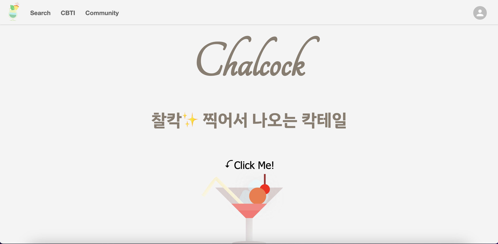
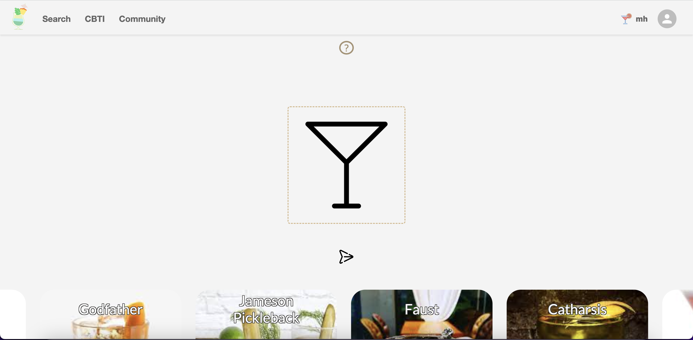
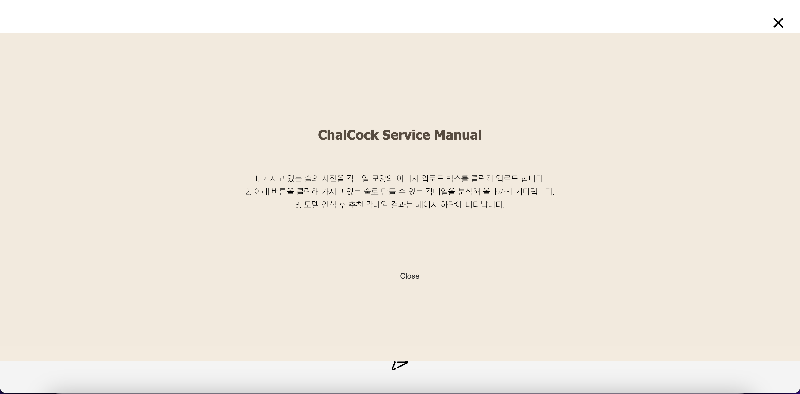
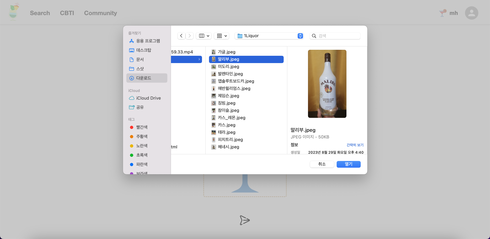
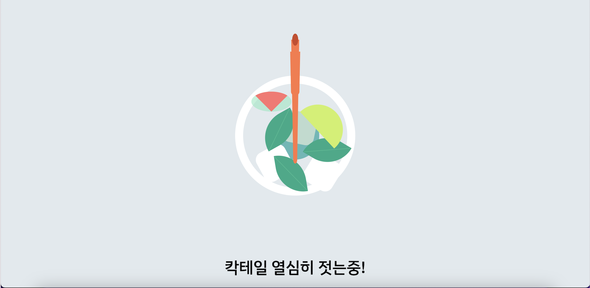
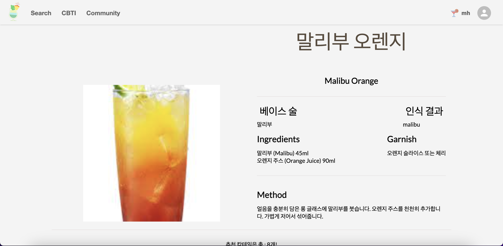
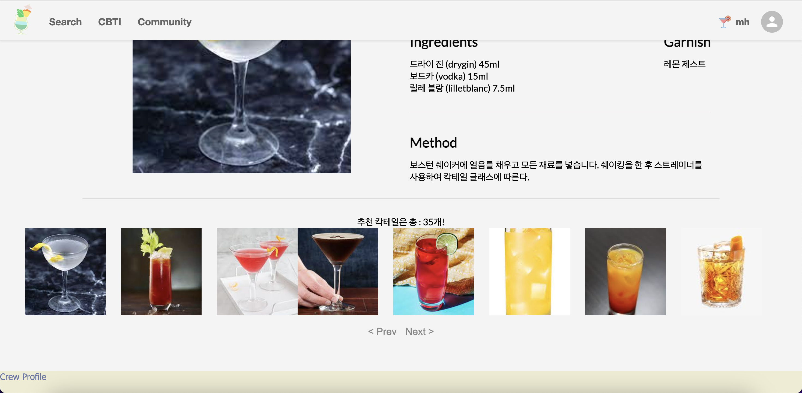
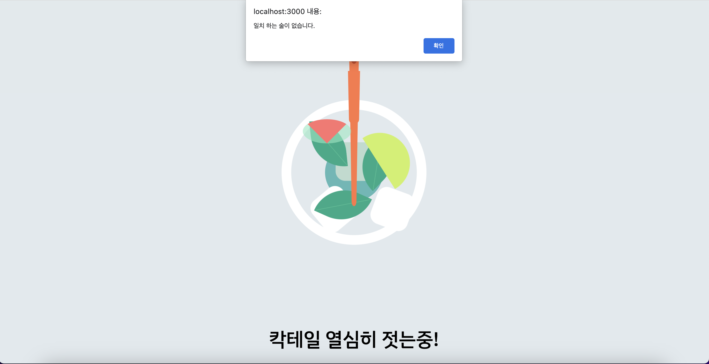
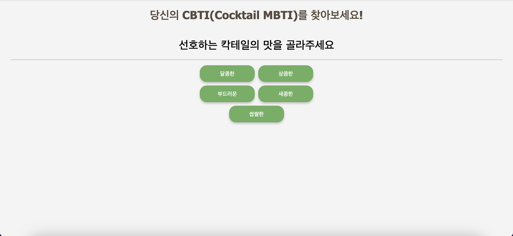
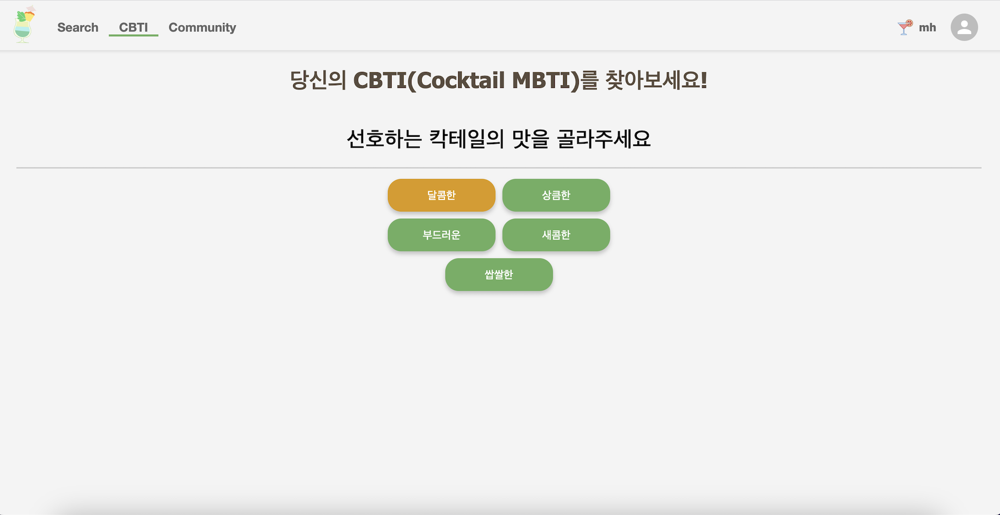

# ChalCock(찰칵)

**찰** 칵 찍어서 나타나는 **칵** 테일 서비스 

## 목차

---
- [참고](#참고)
- [Q&A](#Q&A)
- [사용스택](#사용스택)
- [메인화면](#메인화면)
  - [네비게이션바](#네비게이션바)
  - [업로드페이지](#업로드페이지)
    - [도움말버튼](#도움말버튼)
    - [업로드박스](#업로드박스)
    - [Rules](#rules)
    - [Character_data](#character_data)
  - [직위관리](#직위관리-페이지)
    - [Cozem](#cozem)
    - [Warning](#warning)
    - [Pause](#pause)
    - [Donated_Cozem](#donated_cozem)
  - [아카이브](#아카이브)
  - [이것저것](#이것저것)
  - [피드백남기기](#피드백남기기)
## 참고
---

## Q&A
---
Q. 몇가지의 칵테일 종류가 있나요?
- A. 국제 바텐더 협회(IBA)인증 칵테일 90개 + 국내 후기 가장 많은 칵테일 바 3개에서 판매하는 칵테일 78개 = 총 168개의 칵테일이 있습니다.

Q. 어떤 기능들이 있나요?
- A. 아래의 내용을 참고해주세요.

Q. 술은 몇가지를 인식하나요?
- A. 25개 입니다.

## 사용스택
---
### FrontEnd

**REACT**

**JAVASCRIPT**

**CSS**

**HTML**

### BACKEND

**JAVA**

**PYTHON**

**SPRINGBOOT**

**GRADLE**

### VISION

**FLASK**

**PYTHON**

**YOLO**

### DB

**Maria DB**

**AWS RDS**

## 메인화면
---
* 웹서비스에 접속하면 바로 보이는 화면입니다.

* 상단의 Navigation Bar에는 좌측에 로고, Seacrh, CBTI, Commutnity가 있습니다.

* 우측에는 아이콘을 클릭해 회원가입 및 로그인 메뉴가 있습니다.

## 네비게이션바
---
* 먼저 네비게이션바입니다

* 네비게이션바에는 각 페이지로 이동할 수 있는 메뉴 창

* 로고를 클릭하면 홈으로 이동할 수 있는 버튼

* Cocktail Search 메뉴로 이동할 수 있는 SEARCH 버튼

* CBTI 추천을 받을 수 있는 CBTI메뉴

* 커뮤니티 페이지로 이동 가능한 COMMUNITY메뉴

* 우측에는 회원가입 및 로그인이 가능한 아이콘이 있습니다.

## 업로드페이지
---
* 업로드 부분은, 메인화면에 있는 Click Me! 혹은 칵테일 모양의 그림을 클릭하면, 화면 하단의 업로드 기능이 구현된 곳으로 이동합니다.

* 업로드 페이지에는 ?모양의 도움말 버튼, 이미지 업로드 박스, 아래에는 168개의 칵테일 종류가 애니메이션으로 구현되어 있습니다.

> ### 도움말버튼
---
* 도움말 버튼을 클릭하면 다음의 화면이 나타납니다.

* ChalCock 서비스의 사용법이 나타납니다.

* 도움말 화면을 닫을때에는, 아래의 close버튼, 우측 상단의 X버튼, 또는 화면 빈 공간을 클릭해도 닫을 수 있게 구현했습니다.

> ### 업로드박스
---
* 보유한 술을 사진 찍어서 이미지 첨부하는 기능을 가진 업로드 박스입니다.

* 위와 같은 화면에서, 업로드 박스를 클릭하면, 이미지 업로드 할 수있는 창이 나타나고, 사진을 업로드 하면 됩니다.

* 그러면 다음과 같이 로딩페이지가 나타나며

* 다음과 같이 사진의 술을 인식 후 사진의 술로 만들 수 있는 칵테일을 추천해줍니다.

* 추천 칵테일은 한번의 리스트에 8개까지 구현했으며, 각각 이미지를 클릭하면 해당하는 사진의 맞는 정보가 표시됩니다.

* 또한 8개가 넘는 결과가 나오면, next버튼으로 다음 페이지도 볼 수 있으며, prev버튼을 통해 이전의 페이지로 이동할 수도 있습니다.

* 모델에 없는 종류의 술을 업로드 하면, 다음과 같이 인식 할 수 없다는 경고창이 나타납니다.

## CBTI
---
* 칵테일 입문자를 위한 3가지 질문을 통해 질문에 맞는 선호도에 따라 칵테일을 추천해주는 시스템입니다.

> ### 옵션 선택

* 질문에 해당하는 옵션을 클릭하면 다음과 같이 주황색으로 체크되면서, 다음 질문으로 넘어갑니다.

## 직위관리 페이지
---
* 직위관리 페이지는 총 5개의 탭으로 이루어져 있습니다.

* 각 탭의 소개는 기능을 소개하면서 진행하겠습니다.

> ### Cozem
---
* 먼저 코어젬스톤 탭입니다.

* 아기자기 길드는 주간 길드컨텐츠 이행에 따른 점수에 대해 보상을 지급해주는 '위클리 이벤트' 제도를 시행하고 있습니다.

* 길드컨텐츠는 각각 주간미션, 지하수로, 플래그가 있습니다.
* 그중에서 지하수로는 500점당 코어젬스톤 1개, 플래그는 500점 까지는 0개, 500점부터 750점 까지는 1개, 750점 부터 1000점 미만까지는 2개, 1000점은 3개를 지급하고 있습니다.
* 또한, 아기자기 길드 규정상 노블레스 스킬을 사용하려면 주간미션 3점, 플래그와 지하수로는 1점 이상 기록해야 합니다.
* 예외로, 주간미션이 5점인 경우, 지하수로가 1500점이상이거나, 플래그가 650점 이상인 경우에는 각각 플래그와 지하수로를 이행하지 않더라도 노블레스 스킬을 사용할 수 있습니다.
* 위와 같은 규정에 따라 점수에 따른 코어젬스톤 지급 갯수 계산, 노블레스 스킬 사용가능/불가능 여부, 총 지급해야하는 코어젬스톤 갯수와 간부진들이 분배해서 몇개를 나눠주어야 하는지 계산하는 기능을 포함하고 있습니다.

* 기능선택에는 다음의 사진과 같은 기능이 있습니다.

* 이름추가는 길드원들의 명단을 표에 저장하는 기능입니다.

* 데이터추가는 추가해둔 이름을 바탕으로, 본캐인지, 부캐인지 선택받고, 길드컨텐츠 점수를 입력합니다. 입력해둔 점수를 바탕으로 코어젬스톤 갯수를 계산해서 표에 저장해줍니다.

* 데이터조회는 클릭하면 저장한 데이터를 확인할 수 있습니다.

* 데이터삭제는 잘못 입력한 데이터를 표에서 원하는 행의 번호를 입력하면 삭제해주는 기능을 가지고 있습니다.

* 데이터초기화는 한번에 데이터를 초기화 하고자 할때 사용합니다.

* 노블사용/제한은 계산한 값에 따라 노블레스 스킬을 사용가능한지, 불가능한지를 계산해서 명단을 보여줍니다.

* 위클리 코젬계산은 전체의 코젬총합을 계산해주고, 그에따라 5명의 간부진이 나눠내야하는 코어젬스톤의 갯수를 보여줍니다.

* 데이터 다운로드는 입력해둔 표의 데이터를 xlsx 파일로 다운로드 받을 수 있는 탭입니다.

> ### Warning
---
* 경고자 관리 탭입니다.
* 노블레스 스킬 사용제한에 걸린 길드원은 경고를 1회 얻습니다.

* 경고가 총 3회 될 경우에는 길드에서 퇴출됩니다.

> ### Pause
---
* 유예자 관리 탭입니다.

* 개인사정으로 길드 컨텐츠에 참여하게 되지 못할 경우에 사용하는 탭입니다.
* 인정될 만한 사유의 경우, 유예자 명단에 등록하고, 해당 기간 동안 길드컨텐츠는 면제됩니다.

> ### Donated_cozem
---
* 간혹 위클리 이벤트나, 개인적으로 길드를 위해 코젬을 기부해주는 분들의 기부내역을 정리해두는 페이지 입니다.

* 기부받은 코어젬스톤을 길드 이벤트에 사용할 경우, 사용 내역도 기록합니다.

## 아카이브
---
* 길드에서 디자인을 담당해주는 간부인 "**릎샴**" 님의 재능기부로 만들어진 포스터를 저장해두는 페이지입니다.

* 포스터/길드사진 중에서 선택할 수 있습니다.

* 포스터를 선택하면 포스터의 내역을 볼 수 있습니다.

* 길드사진을 선택하면 길드원들끼리의 사진을 볼수 있습니다.

## 이것저것
---
* 이 페이지는 지나간 이벤트 내역등을 저장해둔 탭입니다.

* 캡쳐 사진으로 일부 보여드리겠습니다.

## 피드백남기기
---
* 페이지 제작자에게 피드백을 남기는 탭입니다.

